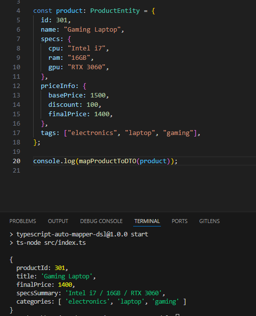

// README.md

# 🔄 TypeScript AutoMapper DSL

A lightweight and extensible object mapper in TypeScript using a simple DSL syntax to convert Entities to DTOs with full type safety.

---

## 🚀 Features

- 🔁 Nested, object, and array transformation
- 🔒 Strong type support with generics
- 🧠 DSL-based configuration
- ✅ Ideal for use with RTK Query `transformResponse`
- ♻️ Reusable mapping logic

---

## 🧪 Example: Map `ProductEntity` → `ProductDTO`

### Input `ProductEntity`
```ts
const product = {
  id: 301,
  name: 'Gaming Laptop',
  specs: { cpu: 'Intel i7', ram: '16GB', gpu: 'RTX 3060' },
  priceInfo: { basePrice: 1500, discount: 100, finalPrice: 1400 },
  tags: ['electronics', 'laptop', 'gaming'],
};
```

### Target `ProductDTO`
```ts
interface ProductDTO {
  productId: number;
  title: string;
  finalPrice: number;
  specsSummary: string;
  categories: string[];
}
```

### DSL Mapping Config
```ts
const productToDTOModel = {
  productId: 'id',
  title: 'name',
  finalPrice: 'priceInfo.finalPrice',
  specsSummary: (src) => `${src.specs.cpu} / ${src.specs.ram} / ${src.specs.gpu}`,
  categories: 'tags'
};
```

### Result
```ts
const dto = mapModel(product, productToDTOModel);
// → {
//   productId: 301,
//   title: 'Gaming Laptop',
//   finalPrice: 1400,
//   specsSummary: 'Intel i7 / 16GB / RTX 3060',
//   categories: ['electronics', 'laptop', 'gaming']
// }
```

---

## 📁 Folder Structure
```
ts-automapper-dsl/
├─ src/
│  ├─ auto-mapper.ts
│  ├─ map-model.ts
│  ├─ index.ts
│  └─ models/
│     ├─ product.dto.ts
│     ├─ product.entity.ts
│     └─ product.mapper.ts
```

---

## 📦 Install & Run

```bash
npm install
npm run start
```

---



## ✅ Recommendation

Use `mapModel()` + separated DSL config files to:
- Avoid repetitive mapping
- Keep transformations readable and testable
- Work across client/server consistently

---

## 📌 Inspired by
- AutoMapper (.NET)
- class-transformer (NestJS)

---

MIT License © 2024
